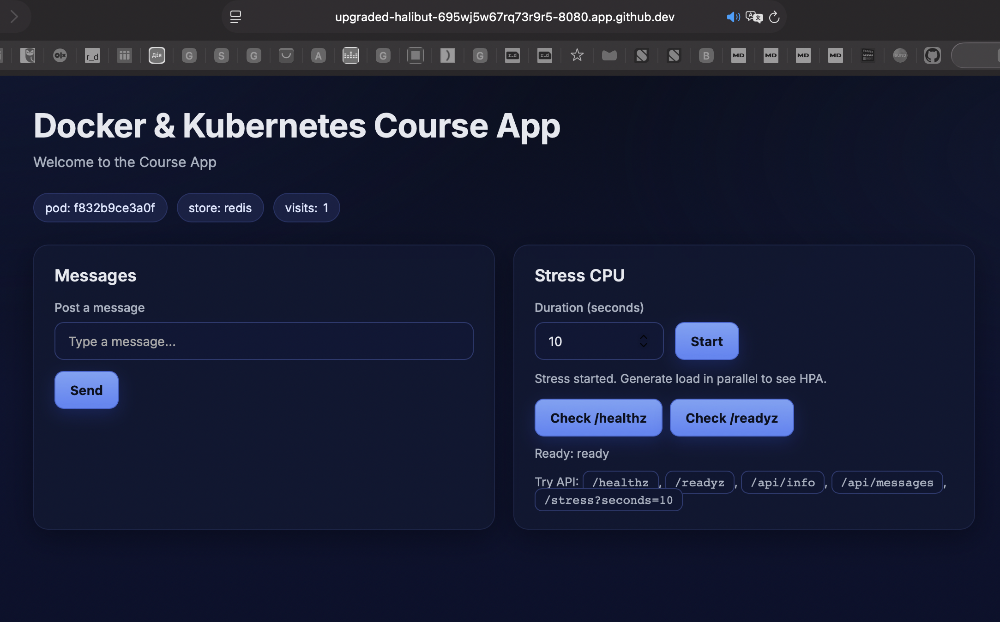
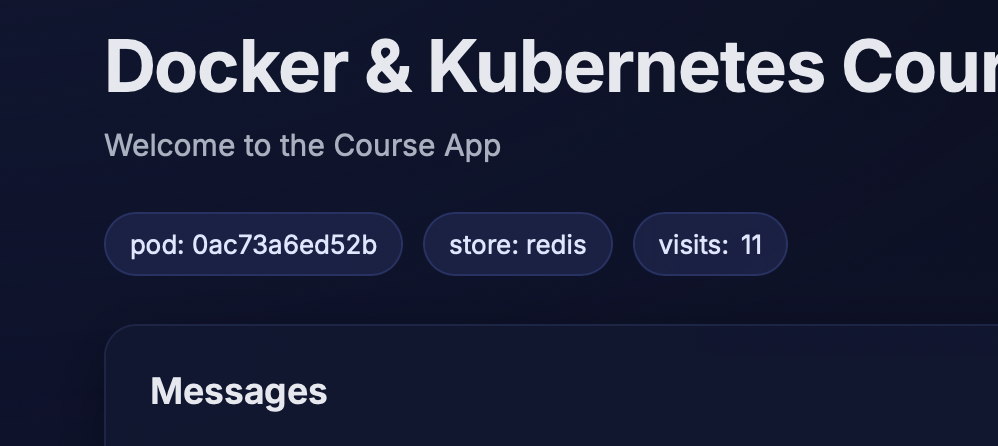
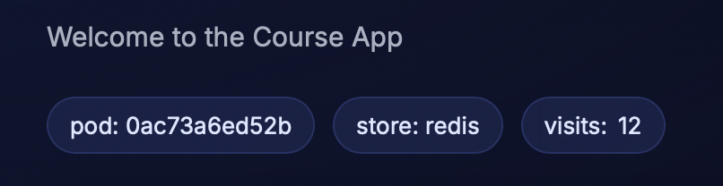

# homework-lesson-05-Yevhen-Marholin

## Docker Compose для course-app

У межах цього завдання було описано `docker-compose.yml` для застосунку `apps/course-app`.

## Dockerfile

Для запуску застосунку використовується такий `Dockerfile`:

```dockerfile
FROM python:3.12-alpine

WORKDIR /src

COPY requirements.txt .
RUN pip install --no-cache-dir -r requirements.txt

COPY . .

EXPOSE 8080

CMD ["uvicorn", "src.main:app", "--host", "0.0.0.0", "--port", "8080"]
```

## Compose файл

```yaml
services:
  app:
    build: .
    container_name: course-app
    ports:
      - "8080:8080"
    environment:
      APP_STORE: redis
      APP_REDIS_URL: redis://redis:6379/0
    depends_on:
      redis:
        condition: service_healthy
    volumes:
      - appdata:/app/data
    healthcheck:
      test: ["CMD-SHELL", "wget -qO- http://127.0.0.1:8080/healthz || exit 1"]
      interval: 10s
      timeout: 5s
      retries: 5
      start_period: 10s

  redis:
    image: redis:7-alpine
    container_name: course-app-redis
    command: ["redis-server", "--appendonly", "yes"]
    volumes:
      - appdata:/data
    healthcheck:
      test: ["CMD", "redis-cli", "ping"]
      interval: 10s
      timeout: 5s
      retries: 5
      start_period: 5s

volumes:
  appdata:
```

## Запуск

```bash
docker compose up -d --build

@YevhenMarholin ➜ /workspaces/homework-lesson-05-Yevhen-Marholin-/course-app (main) $ docker compose up -d --build
[+] Running 11/11
 ✔ redis Pulled                                                                                                  2.2s 
   ✔ 6447bc944d85 Pull complete                                                                                  0.2s 
   ✔ 9572acab3f32 Pull complete                                                                                  0.3s 
   ✔ 897d797d2723 Pull complete                                                                                  0.6s 
   ✔ 47836b8a3274 Pull complete                                                                                  1.0s 
   ✔ 1f0676652ae4 Pull complete                                                                                  0.4s 
   ✔ 2da9501c87e4 Pull complete                                                                                  0.4s 
   ✔ 51bf34b872a6 Pull complete                                                                                  0.7s 
   ✔ 4f4fb700ef54 Pull complete                                                                                  0.4s 
   ✔ 2074d4e4f1bb Download complete                                                                              0.0s 
   ✔ c3c3ab8d6b01 Download complete                                                                              0.0s 
[+] Building 13.6s (13/13) FINISHED                                                                                   
 => [internal] load local bake definitions                                                                       0.0s
 => => reading from stdin 563B                                                                                   0.0s
 => [internal] load build definition from Dockerfile                                                             0.0s
 => => transferring dockerfile: 247B                                                                             0.0s
 => [internal] load metadata for docker.io/library/python:3.12-alpine                                            1.0s
 => [auth] library/python:pull token for registry-1.docker.io                                                    0.0s
 => [internal] load .dockerignore                                                                                0.0s
 => => transferring context: 2B                                                                                  0.0s
 => [1/5] FROM docker.io/library/python:3.12-alpine@sha256:236173eb74001afe2f60862de935b74fcbd00adfca247b2c2705  1.1s
 => => resolve docker.io/library/python:3.12-alpine@sha256:236173eb74001afe2f60862de935b74fcbd00adfca247b2c2705  0.0s
 => => sha256:3a4f2e6e1560fccb75f8aa9c6b7458b3179164f6378b125e533286c88351cd2a 250B / 250B                       0.1s
 => => sha256:fd21a26fb55d22baaa317c98a4296e6a284dd39cc0f9e68ef781bb74adfd6dc7 13.74MB / 13.74MB                 0.5s
 => => sha256:254ac41e2afd13e7a1276627191463329b96d835eab35e7804fdad56d7e363d5 455.66kB / 455.66kB               0.5s
 => => sha256:6a0ac1617861a677b045b7ff88545213ec31c0ff08763195a70a4a5adda577bb 3.86MB / 3.86MB                   0.5s
 => => extracting sha256:6a0ac1617861a677b045b7ff88545213ec31c0ff08763195a70a4a5adda577bb                        0.1s
 => => extracting sha256:254ac41e2afd13e7a1276627191463329b96d835eab35e7804fdad56d7e363d5                        0.1s
 => => extracting sha256:fd21a26fb55d22baaa317c98a4296e6a284dd39cc0f9e68ef781bb74adfd6dc7                        0.4s
 => => extracting sha256:3a4f2e6e1560fccb75f8aa9c6b7458b3179164f6378b125e533286c88351cd2a                        0.0s
 => [internal] load build context                                                                                0.0s
 => => transferring context: 25.74kB                                                                             0.0s
 => [2/5] WORKDIR /src                                                                                           1.1s
 => [3/5] COPY requirements.txt .                                                                                0.0s
 => [4/5] RUN pip install --no-cache-dir -r requirements.txt                                                     7.3s
 => [5/5] COPY . .                                                                                               0.1s
 => exporting to image                                                                                           2.7s
 => => exporting layers                                                                                          2.1s
 => => exporting manifest sha256:8ebac028870e8708f00ae9d1800b181f5a224f9a265ccb8a1eec79df28902f28                0.0s
 => => exporting config sha256:6d1804a1b9af915697c360304e16e9ed62da57c2449c9ce2e70ac172c28f7fc3                  0.0s
 => => exporting attestation manifest sha256:9ce400bb952ea7d4dafaa402cec3a63ca4b7552c9f7b5354fb093cd2ed8db653    0.0s
 => => exporting manifest list sha256:9452b8c7ea04a37efaeb50951eb8543a3d3eda960c37915fbefd4bf33e2512ad           0.0s
 => => naming to docker.io/library/course-app-app:latest                                                         0.0s
 => => unpacking to docker.io/library/course-app-app:latest                                                      0.5s
 => resolving provenance for metadata file                                                                       0.0s
[+] Running 5/5
 ✔ course-app-app              Built                                                                             0.0s 
 ✔ Network course-app_default  Created                                                                           0.0s 
 ✔ Volume course-app_appdata   Created                                                                           0.0s 
 ✔ Container course-app-redis  Healthy                                                                           7.1s 
 ✔ Container course-app        Started  

```

## Перевірка роботи застосунку

Відкрити у браузері:

- http://localhost:8080
- http://localhost:8080/healthz


Або перевірити через термінал:

```bash
curl http://localhost:8080
curl http://localhost:8080/healthz

@YevhenMarholin ➜ /workspaces/homework-lesson-05-Yevhen-Marholin-/course-app (main) $ curl http://localhost:8080
curl http://localhost:8080/healthz

        <html>
            <head>
                <title>Course App</title>
                <meta name=viewport content="width=device-width, initial-scale=1" />
                <link rel="preconnect" href="https://fonts.googleapis.com" />
                <link rel="preconnect" href="https://fonts.gstatic.com" crossorigin />
                <link href="https://fonts.googleapis.com/css2?family=Inter:wght@400;500;600;700&display=swap" rel="stylesheet" />
                <style>
                    :root {
                        --bg:#0b1020;
                        --bg-grad1:#0b1020; /* start */
                        --bg-grad2:#0d1330; /* mid */
                        --bg-grad3:#0a0f28; /* end */
                        --card:#101833cc; /* translucent */
                        --card-border:#28345f80;
                        --text:#e6e8ef;
                        --muted:#a7b0c0;
                        --accent:#7aa2f7;
                        --accent-600:#5d87f6;
                        --accent-700:#4b75ea;
                        --ok:#98c379; --warn:#e5c07b; --err:#e06c75;
                        --ring:#9ab6ff;
                    }

                    * { box-sizing: border-box; }
                    html, body { height: 100%; }
                    body {
                        font-family: "Inter", system-ui, -apple-system, Segoe UI, Roboto, sans-serif;
                        margin:0;
                        color:var(--text);
                        background:
                            radial-gradient(1200px 600px at 10% -10%, #20327544, transparent 60%),
                            radial-gradient(1000px 500px at 95% 10%, #1b254d55, transparent 60%),
                            linear-gradient(180deg, var(--bg-grad1) 0%, var(--bg-grad2) 40%, var(--bg-grad3) 100%);
                    }

                    .wrap {
                        max-width: 1100px;
                        margin: 0 auto;
                        padding: 32px clamp(20px, 4vw, 40px) 48px;
                    }

                    header.app {
                        display:flex; align-items:flex-start; justify-content:space-between; gap:16px;
                        margin-bottom: 24px;
                    }
                    h1 { margin: 0; font-size: clamp(28px, 2.4vw, 36px); letter-spacing: -0.015em; }
                    p.lead { margin: 8px 0 0 0; color: var(--muted); font-size: 15px; }

                    .pillbar { margin:12px 0 24px 0; display:flex; flex-wrap:wrap; gap:10px; }
                    .badge {
                        display:inline-flex; align-items:center; gap:6px;
                        background: #1b254dcc; color:#dde6ff; padding:7px 12px;
                        border:1px solid #2a376ecc; border-radius:999px; font-size:13px;
                        backdrop-filter: blur(6px);
                    }

                    .grid { display: grid; grid-template-columns: repeat(auto-fit, minmax(300px, 1fr)); gap: 20px; }
                    .card {
                        background: var(--card);
                        border:1px solid var(--card-border);
                        border-radius: 16px;
                        padding: 22px;
                        box-shadow: 0 8px 32px rgba(0,0,0,0.35);
                        backdrop-filter: blur(10px);
                    }
                    .card h3 { margin: 0 0 16px 0; font-size: 18px; font-weight: 600; }

                    label { display:block; font-size: 13px; font-weight: 500; color: var(--muted); margin-bottom: 8px; }
                    input[type=text], input[type=number] {
                        width:100%; background:#0f1736; color:var(--text); font-size: 14px;
                        border:1px solid #2b3970; padding:11px 14px; border-radius:10px;
                        outline: none; transition: box-shadow .15s ease, border-color .15s ease;
                    }
                    input[type=text]:focus, input[type=number]:focus {
                        border-color: var(--ring);
                        box-shadow: 0 0 0 3px #9ab6ff33;
                    }

                    button {
                        background: linear-gradient(180deg, var(--accent) 0%, var(--accent-600) 90%);
                        border: 1px solid #4569d6;
                        color: #0b1020; font-weight: 700; font-size: 14px; letter-spacing: .01em;
                        padding: 11px 16px; border-radius: 10px; cursor: pointer;
                        transition: transform .06s ease, filter .2s ease, box-shadow .2s ease;
                        box-shadow: 0 6px 18px #2540a855;
                    }
                    button:hover { filter: brightness(1.02); box-shadow: 0 8px 22px #2540a866; }
                    button:active { transform: translateY(1px); }
                    button:disabled { opacity: .6; cursor: default; box-shadow:none; }

                    ul.msgs {
                        list-style:none; padding:0; margin:0;
                        display:flex; flex-direction:column; gap:12px;
                        max-height:300px; overflow-y:auto;
                        scrollbar-width: thin;
                        scrollbar-color: #2b3970 transparent;
                    }
                    ul.msgs::-webkit-scrollbar { width: 8px; }
                    ul.msgs::-webkit-scrollbar-track { background: transparent; }
                    ul.msgs::-webkit-scrollbar-thumb { background: #2b3970; border-radius: 4px; }
                    ul.msgs::-webkit-scrollbar-thumb:hover { background: #3a4a8a; }
                    ul.msgs li { background:#0f1632; border:1px solid #2b3970; padding:14px; border-radius:10px; }

                    .row { display:flex; gap:12px; align-items:center; flex-wrap:wrap; }
                    code { background:#0f1632; border:1px solid #2b3970; padding:4px 9px; border-radius:8px; font-size: 13px; }
                    a { color:#9ab6ff; text-decoration: none; }
                    a:hover { text-decoration: underline; }
                </style>
            </head>
      <body>
                <div class="wrap">
                    <header class="app">
                        <div>
                            <h1>Docker & Kubernetes Course App</h1>
                            <p class="lead">Welcome to the Course App</p>
                        </div>
                    </header>
                    <div class="pillbar">
                        <span class="badge">pod: f832b9ce3a0f</span>
                        <span class="badge">store: redis</span>
                        <span class="badge">visits: <span id="visits">2</span></span>
                    </div>

          <div class="grid">
            <section class="card">
              <h3>Messages</h3>
              <form id="msgForm" onsubmit="return false;" style="margin-bottom:14px">
                <label for="msgInput">Post a message</label>
                <div class="row">
                  <input id="msgInput" type="text" placeholder="Type a message..." />
                  <button id="btnPost">Send</button>
                </div>
                <div id="msgStatus" style="font-size:13px;color:var(--muted);margin-top:6px;"></div>
              </form>
              <ul id="msgList" class="msgs"></ul>
            </section>

            <section class="card">
              <h3>Stress CPU</h3>
              <label for="secInput">Duration (seconds)</label>
              <div class="row" style="margin-bottom:12px">
                <input id="secInput" type="number" min="1" max="120" value="10" style="max-width:140px" />
                <button id="btnStress">Start</button>
              </div>
              <div id="stressStatus" style="font-size:13px;color:var(--muted);margin-bottom:14px;">Runs background CPU work to demo HPA.</div>
              <div style="margin-bottom:14px">
                <div class="row" style="gap:8px">
                  <button id="btnHealth">Check /healthz</button>
                  <button id="btnReady">Check /readyz</button>
                </div>
                <div id="hzStatus" style="font-size:13px;margin-top:10px;color:var(--muted);"></div>
              </div>
              <div style="font-size:13px;color:var(--muted);line-height:1.5;">
                Try API: <code>/healthz</code>, <code>/readyz</code>, <code>/api/info</code>, <code>/api/messages</code>, <code>/stress?seconds=10</code>
              </div>
            </section>
          </div>
        </div>

        <script>
          async function fetchJSON(url, opts={}) {
            const r = await fetch(url, opts);
            if (!r.ok) throw new Error(await r.text());
            return r.json();
          }

          async function loadMessages() {
            try {
              const data = await fetchJSON('/api/messages?limit=50');
              const list = document.getElementById('msgList');
              list.innerHTML = '';
              for (const it of (data.items || [])) {
                const li = document.createElement('li');
                const dt = new Date(it.created_at || '').toLocaleString();
                li.innerHTML = `<div style="font-size:12px;color:var(--muted)">#${it.id} • ${dt}</div><div>${(it.text||'')}</div>`;
                list.appendChild(li);
              }
            } catch(e) {
              console.warn('loadMessages failed', e);
            }
          }

          async function refreshVisits() {
            try {
              const data = await fetchJSON('/api/counter/visits');
              document.getElementById('visits').textContent = data.value;
            } catch { /* ignore */ }
          }

          document.getElementById('btnPost').addEventListener('click', async () => {
            const input = document.getElementById('msgInput');
            const btn = document.getElementById('btnPost');
            const st = document.getElementById('msgStatus');
            const text = (input.value || '').trim();
            if (!text) return;
            btn.disabled = true; st.textContent = 'Posting...';
            try {
              const body = new URLSearchParams(); body.set('text', text);
              await fetchJSON('/api/messages', { method:'POST', headers:{'Content-Type':'application/x-www-form-urlencoded'}, body });
              input.value=''; st.textContent = 'Posted!';
              await loadMessages(); await refreshVisits();
            } catch(e) {
              st.textContent = 'Error: ' + (e.message || 'failed');
            } finally { btn.disabled = false; }
          });

          document.getElementById('btnStress').addEventListener('click', async () => {
            const sec = Math.max(1, Math.min(120, parseInt(document.getElementById('secInput').value || '10')));
            const st = document.getElementById('stressStatus');
            st.textContent = 'Starting stress for ' + sec + 's...';
            try {
              await fetchJSON(`/stress?seconds=${sec}&background=true`);
              st.textContent = 'Stress started. Generate load in parallel to see HPA.';
            } catch(e) { st.textContent = 'Error: ' + (e.message || 'failed'); }
          });

          document.getElementById('btnHealth').addEventListener('click', async () => {
            const st = document.getElementById('hzStatus');
            try { const x = await fetchJSON('/healthz'); st.textContent = 'Health: ' + x.status; }
            catch(e) { st.textContent = 'Health error'; }
          });
          document.getElementById('btnReady').addEventListener('click', async () => {
            const st = document.getElementById('hzStatus');
            try { const x = await fetchJSON('/readyz'); st.textContent = 'Ready: ' + x.status; }
            catch(e) { st.textContent = 'Ready error'; }
          });

          loadMessages();
        </script>
      </body>
```

## Healthcheck

Для сервісу `app` додано healthcheck на endpoint `/healthz`:

```yaml
healthcheck:
  test: ["CMD-SHELL", "wget -qO- http://127.0.0.1:8080/healthz || exit 1"]
```

Для сервісу `redis` додано healthcheck через `redis-cli ping`:

```yaml
healthcheck:
  test: ["CMD", "redis-cli", "ping"]
```

## volumes

Було додано іменований volume `appdata`:

```yaml
volumes:
  appdata:
```

Том підключено до сервісів `app` і `redis`:

```yaml
volumes:
  - appdata:/app/data
```

```yaml
volumes:
  - appdata:/data
```

Оскільки застосунок використовує зовнішнє сховище Redis (`APP_STORE=redis`), том `appdata` зберігає дані Redis, а разом з ними і лічильник відвідувань між перезапусками контейнерів.

## Перевірка збереження лічильника

1. Запустити застосунок:

```bash
docker compose up -d --build
```

2. Відкрити кілька разів:

```text
http://localhost:8080
```

3. Перезапустити контейнери:

```bash
docker compose down
docker compose up -d

[+] Running 3/3
 ✔ Container course-app        Removed                                                                           0.4s 
 ✔ Container course-app-redis  Removed                                                                           0.1s 
 ✔ Network course-app_default  Removed                                                                           0.0s 
[+] Running 3/3
 ✔ Network course-app_default  Created                                                                           0.0s 
 ✔ Container course-app-redis  Healthy                                                                           5.8s 
 ✔ Container course-app        Started                                                                           5.9s 
@YevhenMarholin ➜ /workspaces/homework-lesson-05-Yevhen-Marholin-/course-app (main) $ 

```

4. Повторно відкрити застосунок і переконатися, що значення лічильника не скинулося.

## Порядок запуску

Для правильного порядку запуску налаштовано залежність:

```yaml
depends_on:
  redis:
    condition: service_healthy
```

Це означає, що сервіс `app` запускається лише після того, як сервіс `redis` стане healthy.

## Змінні середовища

Для підключення зовнішнього сховища Redis використано:

```env
APP_STORE=redis
APP_REDIS_URL=redis://redis:6379/0
```

## Перевірка відсутності помилок

Для перевірки роботи сервісів використовувались команди:

```bash
docker compose ps
docker compose logs


course-app_app.1.gpsutmlvgzut@codespaces-e7a90d    | INFO:     Started server process [1]
course-app_app.1.gpsutmlvgzut@codespaces-e7a90d    | INFO:     Waiting for application startup.
course-app_app.1.gpsutmlvgzut@codespaces-e7a90d    | INFO:     Application startup complete.
course-app_app.1.gpsutmlvgzut@codespaces-e7a90d    | INFO:     Uvicorn running on http://0.0.0.0:8080 (Press CTRL+C to quit)
course-app_app.1.gpsutmlvgzut@codespaces-e7a90d    | INFO:     127.0.0.1:49402 - "GET /healthz HTTP/1.1" 200 OK
course-app_app.1.gpsutmlvgzut@codespaces-e7a90d    | INFO:     127.0.0.1:58156 - "GET /healthz HTTP/1.1" 200 OK
course-app_app.1.gpsutmlvgzut@codespaces-e7a90d    | INFO:     127.0.0.1:56360 - "GET /healthz HTTP/1.1" 200 OK
course-app_app.1.gpsutmlvgzut@codespaces-e7a90d    | INFO:     127.0.0.1:40380 - "GET /healthz HTTP/1.1" 200 OK
course-app_app.1.gpsutmlvgzut@codespaces-e7a90d    | INFO:     127.0.0.1:46658 - "GET /healthz HTTP/1.1" 200 OK
course-app_app.1.gpsutmlvgzut@codespaces-e7a90d    | INFO:     127.0.0.1:49718 - "GET /healthz HTTP/1.1" 200 OK
course-app_app.1.gpsutmlvgzut@codespaces-e7a90d    | INFO:     127.0.0.1:34766 - "GET /healthz HTTP/1.1" 200 OK
```

Після налаштування `healthcheck`, тому `appdata` та залежностей Compose файл запускається коректно, а застосунок працює без помилок.

## Docker Swarm

Було ініціалізовано Docker Swarm:

```bash
docker swarm init
```

Для Swarm було створено окремий файл `docker-stack.yml`.

```yaml
services:
  app:
    image: course-app-app:latest
    ports:
      - "8080:8080"
    environment:
      APP_STORE: redis
      APP_REDIS_URL: redis://tasks.redis:6379/0
    volumes:
      - appdata:/app/data
    healthcheck:
      test: ["CMD-SHELL", "wget -qO- http://127.0.0.1:8080/healthz || exit 1"]
      interval: 10s
      timeout: 5s
      retries: 5
      start_period: 10s

  redis:
    image: redis:7-alpine
    command: ["redis-server", "--appendonly", "yes"]
    volumes:
      - appdata:/data
    healthcheck:
      test: ["CMD", "redis-cli", "ping"]
      interval: 10s
      timeout: 5s
      retries: 5
      start_period: 5s

volumes:
  appdata:
```

Перед деплоєм stack було зібрано образ:

```bash
docker build -t course-app-app:latest .
[+] Building 0.8s (11/11) FINISHED                                                                     docker:default
 => [internal] load build definition from Dockerfile                                                             0.0s
 => => transferring dockerfile: 247B                                                                             0.0s
 => [internal] load metadata for docker.io/library/python:3.12-alpine                                            0.6s
 => [auth] library/python:pull token for registry-1.docker.io                                                    0.0s
 => [internal] load .dockerignore                                                                                0.0s
 => => transferring context: 2B                                                                                  0.0s
 => [1/5] FROM docker.io/library/python:3.12-alpine@sha256:236173eb74001afe2f60862de935b74fcbd00adfca247b2c2705  0.0s
 => => resolve docker.io/library/python:3.12-alpine@sha256:236173eb74001afe2f60862de935b74fcbd00adfca247b2c2705  0.0s
 => [internal] load build context                                                                                0.0s
 => => transferring context: 897B                                                                                0.0s
 => CACHED [2/5] WORKDIR /src                                                                                    0.0s
 => CACHED [3/5] COPY requirements.txt .                                                                         0.0s
 => CACHED [4/5] RUN pip install --no-cache-dir -r requirements.txt                                              0.0s
 => [5/5] COPY . .                                                                                               0.0s
 => exporting to image                                                                                           0.1s
 => => exporting layers                                                                                          0.1s
 => => exporting manifest sha256:491d1a2c57b4569288cffe7add4af90986b96c7dccf834a607a29b291ceff1fc                0.0s
 => => exporting config sha256:522228f0151f3a6531d15e8afe02aebf1eacbd4f366e40f39de535a4bd8e4f7e                  0.0s
 => => exporting attestation manifest sha256:b463db8f45c426343f10810616a8c1ef8efb67ed5c0f2f380c5bf8cb1400f127    0.0s
 => => exporting manifest list sha256:076fe94312cd2b44ac008c819640cd75c15c4f1f3d612bc70256e3ebfd89dc7a           0.0s
 => => naming to docker.io/library/course-app-app:latest                                                         0.0s
 => => unpacking to docker.io/library/course-app-app:latest                                
```

Деплой stack:

```bash
docker stack deploy -c docker-stack.yml course-app
Since --detach=false was not specified, tasks will be created in the background.
In a future release, --detach=false will become the default.
Creating network course-app_default
Creating service course-app_app
Creating service course-app_redis
```

Перевірка сервісів:

```bash
docker stack services course-app
docker stack ps course-app
docker service logs course-app_app

course-app_app.1.2h7ia5vyey0n@codespaces-e7a90d    | INFO:     Started server process [1]
course-app_app.1.2h7ia5vyey0n@codespaces-e7a90d    | INFO:     Waiting for application startup.
course-app_app.1.2h7ia5vyey0n@codespaces-e7a90d    | INFO:     Application startup complete.
course-app_app.1.2h7ia5vyey0n@codespaces-e7a90d    | INFO:     Uvicorn running on http://0.0.0.0:8080 (Press CTRL+C to quit)
course-app_app.1.2h7ia5vyey0n@codespaces-e7a90d    | INFO:     127.0.0.1:39436 - "GET /healthz HTTP/1.1" 200 OK
course-app_app.1.2h7ia5vyey0n@codespaces-e7a90d    | INFO:     127.0.0.1:53702 - "GET /healthz HTTP/1.1" 200 OK
course-app_app.1.2h7ia5vyey0n@codespaces-e7a90d    | INFO:     127.0.0.1:57084 - "GET /healthz HTTP/1.1" 200 OK
course-app_app.1.2h7ia5vyey0n@codespaces-e7a90d    | INFO:     127.0.0.1:60900 - "GET /healthz HTTP/1.1" 200 OK
```

## Висновок

Ми повністю виконали завдання:

- описали Compose файл для `apps/course-app`
- додали `healthcheck` для сервісів
- додали том `appdata`
- перевірили, що том `appdata` зберігає лічильник відвідувань між перезапусками контейнера
- налаштували залежності та порядок запуску сервісів
- перевірили доступність застосунку на `http://localhost:8080`
- перевірили працездатність `/healthz`
- переконалися, що Compose файл та застосунки працюють без помилок
- опціонально ініціалізували Docker Swarm і задеплоїли stack